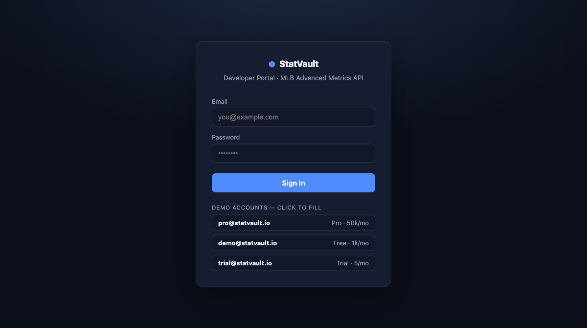
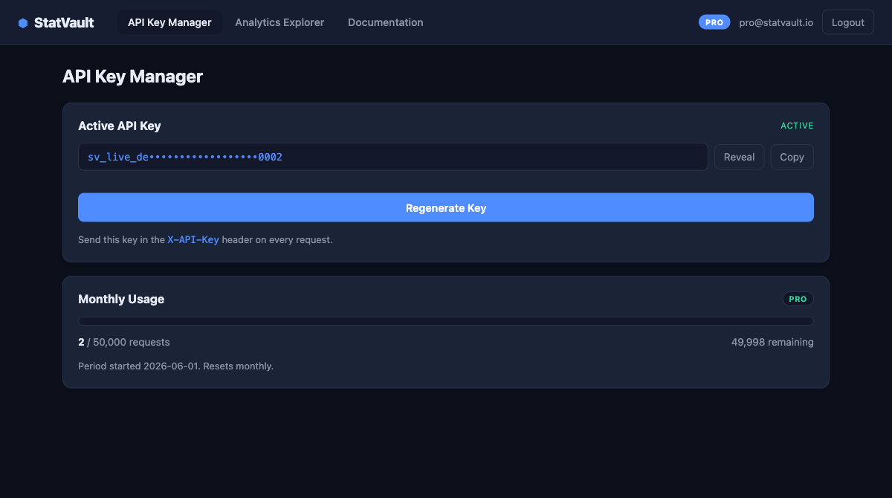
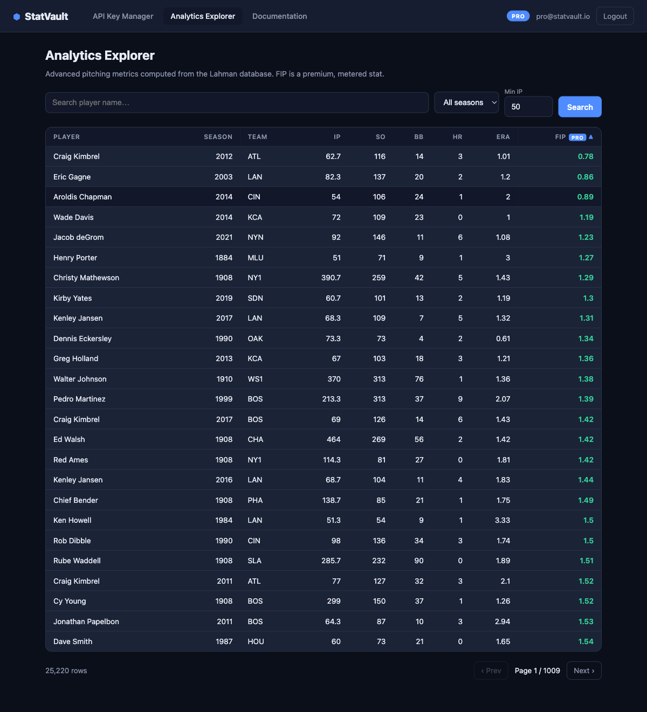
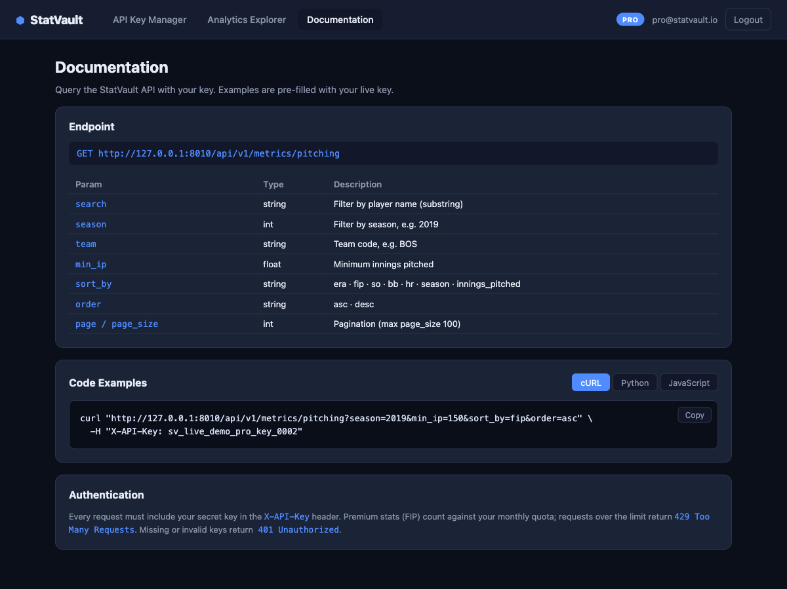

# StatVault

Full-stack **multi-sport** analytics platform: automated data pipelines → advanced
metrics → paywalled API → React developer portal. Covers **MLB**, **NFL**, and **NBA**.

```
MLB: Lahman CSVs ─┐
NFL: nflverse-data ┼─ingest─▶ PostgreSQL (mlb/nfl/nba schemas) ─matviews─▶ FastAPI (API-key paywall) ─▶ React
NBA: nba_api / hoopR ┘
```

## Stack

| Layer            | Tech                                                       |
|------------------|------------------------------------------------------------|
| Data / pipeline  | Python, pandas, SQLAlchemy 2.0, nba_api                     |
| Database         | PostgreSQL 16 (Homebrew), schema-isolated: `mlb`/`nfl`/`nba`|
| Advanced metrics | SQL materialized views (ERA/FIP, ANY/A, TS%)               |
| API              | FastAPI + Uvicorn, `X-API-Key` paywall, shared usage meter |
| Frontend         | React 18 + Vite                                            |

## Screenshots

Developer portal, signed in as the seeded `pro` demo account.

| | |
|---|---|
| **Login** — demo accounts are click-to-fill, so a reviewer can get in without reading the seed script. <br><br>  | **API Key Manager** — the key stays masked until revealed, and usage is metered against the plan's monthly limit. <br><br>  |
| **Analytics Explorer** — 25,220 pitching seasons, server-side filtered, sorted and paginated. FIP is flagged `PRO` because it is metered. <br><br>  | **Documentation** — parameter reference plus cURL, Python and JavaScript examples, pre-filled with the signed-in key. <br><br>  |

## Sports & premium metrics

| Sport | Schema | Source              | View                  | Premium metric                                  |
|-------|--------|---------------------|-----------------------|-------------------------------------------------|
| MLB   | `mlb`  | Lahman DB           | `mlb.pitching_metrics`| **ERA**, **FIP** (per-season FIP constant)      |
| NFL   | `nfl`  | nflverse-data       | `nfl.passing_metrics` | **ANY/A** (Adjusted Net Yards per Pass Attempt) |
| NBA   | `nba`  | nba_api / hoopR-data| `nba.scoring_metrics` | **TS%** (True Shooting Percentage)              |

## What's inside

- **Ingestion** — `scripts/ingest.py` (MLB Lahman), `scripts/ingest_nfl.py` (nflverse
  weekly stats + rosters), `scripts/ingest_nba_api.py` (live nba_api, rate-limited with
  `time.sleep`) and `scripts/ingest_nba.py` (offline hoopR-data fallback). All coerce
  bad values to NULL instead of crashing.
- **Schema isolation** — `scripts/migrate_to_schemas.py` moves MLB objects into the
  `mlb` schema in-place (non-destructive `ALTER ... SET SCHEMA`) and creates `nfl`/`nba`.
  App tables (`users`, `api_keys`) stay in `public` (cross-sport).
- **Feature engineering** — `scripts/create_views.py` builds all three materialized
  views with metric math in SQL, indexed on season + player name.
- **Paywall API** (`backend/app`) — every premium endpoint (FIP, ANY/A, TS%) is
  protected by the **same** `require_quota` dependency: valid `X-API-Key` required,
  metered against a monthly limit, `429` when exceeded.
- **Developer portal** (`frontend`) — login → dashboard (API Key Manager, Analytics
  Explorer, Documentation). *Note: the portal currently surfaces the MLB Analytics
  Explorer; NFL/NBA are live on the API and in `/docs`.*

## Demo accounts

| Email                | Password   | Plan | Limit    |
|----------------------|------------|------|----------|
| `pro@statvault.io`   | `pro12345` | pro  | 50,000/mo |
| `demo@statvault.io`  | `demo1234` | free | 1,000/mo  |
| `trial@statvault.io` | `trial123` | free | 5/mo      |

## Run it

Prereqs: PostgreSQL 16, Python 3.11+, Node 18+.

```bash
# 1. Start Postgres (Homebrew, keg-only path)
LC_ALL=en_US.UTF-8 /opt/homebrew/opt/postgresql@16/bin/postgres \
  -D /opt/homebrew/var/postgresql@16 &
createdb statvault    # first time only

# 2. Backend
cd backend
python3 -m venv .venv && ./.venv/bin/pip install -r requirements.txt
./.venv/bin/python scripts/migrate_to_schemas.py # create mlb/nfl/nba schemas
./.venv/bin/python scripts/ingest.py             # MLB: load Lahman data
./.venv/bin/python scripts/ingest_nfl.py 2024    # NFL: nflverse weekly stats + rosters
./.venv/bin/python scripts/ingest_nba.py 2023    # NBA: hoopR fallback (or ingest_nba_api.py on an unrestricted network)
./.venv/bin/python scripts/create_views.py       # build all sport views + indexes
./.venv/bin/python scripts/seed_users.py         # create demo users + keys
./.venv/bin/uvicorn app.main:app --port 8010     # API at http://127.0.0.1:8010 (docs at /docs)

# 3. Frontend
cd ../frontend
npm install && npm run dev                   # portal at http://localhost:5173
```

Or use the helper: `./start.sh` (starts Postgres if needed, backend on :8010, frontend on :5173).

## API quick reference

```
POST /api/v1/auth/login            { email, password } -> { user, api_key }
GET  /api/v1/account/me            (X-API-Key)         user info
GET  /api/v1/account/key           (X-API-Key)         current key + status
POST /api/v1/account/key/regenerate(X-API-Key)         rotate secret
GET  /api/v1/account/usage         (X-API-Key)         usage vs monthly limit
GET  /api/v1/metrics/pitching      (X-API-Key, metered) MLB ERA/FIP table
       ?search= &season= &team= &min_ip= &sort_by= &order= &page= &page_size=
GET  /api/v1/nfl/passing           (X-API-Key, metered) NFL ANY/A table
       ?search= &season= &team= &min_attempts= &sort_by= &order= &page= &page_size=
GET  /api/v1/nba/scoring           (X-API-Key, metered) NBA TS% table
       ?search= &season= &team= &min_games= &sort_by= &order= &page= &page_size=
GET  /api/v1/{metrics|nfl|nba}/seasons (X-API-Key)      distinct seasons per sport
```

Auth: missing/invalid key → `401`; over monthly quota → `429`.

Validation spot-checks (match public references): MLB Pedro Martínez 2000 = 1.74 ERA / 2.17 FIP · NFL Jalen Hurts 2024 = 6.93 ANY/A · NBA TS% leaders 2022-23 = Powell/Gafford ~73%, Jokić 70.4%.
